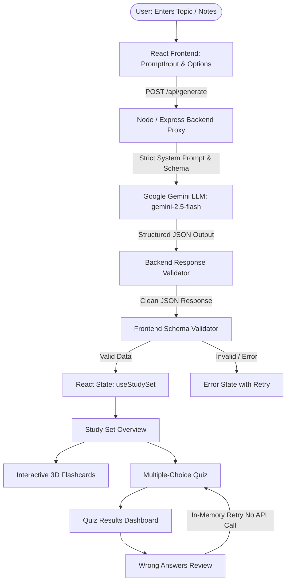

# PrepAI – AI Study Assistant
> **Turn your notes into active learning.**  
> *AI-Powered Interactive Study Tool — Single Express Backend on Render*

PrepAI is an interactive study assistant built with React and Node.js. It transforms free-form study notes, documentation, or technical topics into structured learning materials using Google Gemini (`gemini-2.5-flash`).

Instead of a generic chatbot, PrepAI enforces strict structured JSON schemas on both client and server, rendering interactive **CSS 3D flip flashcards**, **multiple-choice quizzes with instant feedback**, and a **targeted in-memory wrong-answer retry engine**.

---

## 🏗️ System Architecture



---

## ✨ Core Features

- **True CSS 3D Flip Flashcards**:
  - Built with pure CSS 3D (`perspective: 1000px`, `transform-style: preserve-3d`, `backface-visibility: hidden`, `rotateY(180deg)`).
  - Toggles between Question front and Answer + Key Takeaway back.
  - Full keyboard navigation: `Space` / `Enter` to flip, `←` / `P` for previous card, `→` / `N` for next card.
  - Bookmark difficult cards with the star review filter and shuffle deck order.

- **Multiple-Choice Quiz**:
  - 4 answer choices per question with zero hint exposure prior to submission.
  - Instant validation on submit with color-coded feedback and AI explanations.
  - Progress indicator, score tracking, and celebratory confetti for scores $\ge 70\%$.

- **Targeted In-Memory Wrong-Answer Retry**:
  - Review missed questions side-by-side with your chosen answer vs correct answer.
  - Re-tests wrong questions **in-memory without making duplicate LLM API calls**, conserving tokens and eliminating latency.

- **Defensive Local Storage & Search**:
  - Automatically saves generated study sets locally in browser `localStorage`.
  - **Runtime validates stored records upon loading** to prevent corrupted data from crashing the app.
  - Search past study sets by topic, summary, or key concepts.

---

## 🛡️ Comprehensive Failure Handling

| Failure Mode | How PrepAI Handles It |
| :--- | :--- |
| **Malformed JSON** | Backend sanitizes markdown fences, attempts parsing, and catches syntax errors. Frontend displays an `ErrorState` with a **"Try Again"** button. Zero crashes. |
| **Wrong Shape / Missing Fields** | Dual-layer validation (`server/validators/responseValidator.js` & `src/lib/validateResult.ts`) verifies required keys, non-empty strings, array types, and exactly 4 quiz options. |
| **Google Server Demand (503 / 429)** | The LLM service implements **automatic multi-model failover** (`gemini-2.5-flash` → `gemini-flash-latest` → `gemini-2.5-flash-lite` → `gemini-2.5-pro`) to seamlessly recover from traffic spikes. |
| **Request Timeout** | Protected by an explicit **35-second timeout** via `AbortController`. If the model hangs, the client displays a helpful retry message rather than spinning indefinitely. |
| **Stale / Out-of-Order Responses** | `useStudySet` tracks request sequence numbers via `useRef` and cancels old in-flight requests, ensuring slow requests cannot overwrite newer ones. |
| **Corrupted LocalStorage Data** | `src/lib/storage.ts` runs each stored record through `validateResult` upon reading `localStorage` to guarantee state integrity. |
| **API Key Security** | The Gemini API key is stored exclusively on the server (`GEMINI_API_KEY`) and is never shipped or exposed to the browser. |

---

## 💻 Tech Stack

- **Frontend**: React 18, TypeScript, Vite 6, Lucide React, Canvas Confetti, Vanilla CSS (Notion & Linear design system tokens).
- **Backend**: Node.js, Express, `@google/generative-ai` SDK, CORS, Dotenv.

---

## 📁 Project Structure

```
├── server/
│   ├── index.js                     # Express server & static asset serving
│   ├── routes/
│   │   └── generate.js              # POST /api/generate endpoint
│   ├── services/
│   │   └── llmService.js            # Gemini API integration with multi-model failover
│   ├── prompts/
│   │   └── studyPrompt.js           # Strict system & user prompts
│   └── validators/
│       ├── requestValidator.js      # Incoming request validator
│       └── responseValidator.js     # Backend JSON sanitizer & validator
│
├── src/
│   ├── App.tsx                      # App root router & state manager
│   ├── index.css                    # Design tokens & CSS 3D flip card styles
│   ├── main.tsx                     # React root DOM renderer
│   ├── types/
│   │   └── study.ts                 # Study set & quiz type definitions
│   ├── lib/
│   │   ├── api.ts                   # API client with 35s timeout handling
│   │   ├── validateResult.ts        # Client schema validator
│   │   └── storage.ts               # LocalStorage manager with runtime validation
│   ├── hooks/
│   │   ├── useStudySet.ts           # Generation & stale response protection hook
│   │   └── useQuiz.ts               # Quiz state machine & wrong-answer retry hook
│   ├── components/
│   │   ├── layout/                  # AppShell, Sidebar, Header
│   │   ├── input/                   # PromptInput, GenerationOptions, GenerateButton
│   │   ├── states/                  # LoadingState, ErrorState, EmptyState
│   │   └── study/                   # Flashcard (3D), FlashcardDeck, QuizView, WrongAnswerReview
│   └── pages/                       # Home, CreateStudySet, StudySet, History
│
├── .env.example                     # Environment variables template
├── package.json                     # Scripts (build, start, dev)
└── tsconfig.json                    # TypeScript compiler config
```

---

## 🚀 Setup & Running Locally

### 1. Prerequisites
- Node.js `v18+` or `v20+`
- npm `v9+`

### 2. Install Dependencies
```bash
npm install
```

### 3. Configure Environment Variables
Create a `.env` file in the root directory:
```env
PORT=3001
GEMINI_API_KEY=your_gemini_api_key_here
```

### 4. Run Full-Stack Development
```bash
npm run dev
```
*(Runs Express backend on `http://localhost:3001` and Vite frontend on `http://localhost:5173` concurrently)*

### 5. Production Build & Run (Render Deployment)
```bash
npm run build
npm start
```

---

## 🤖 AI Usage Note

AI tools were used during development to accelerate initial boilerplate generation and explore prompt constraints. The core application logic, dual-layer validation pipeline, stale response mitigation (`useRef` + `AbortController`), 35s timeout handling, quiz state machine, and in-memory retry mechanism were designed, implemented, and verified.

---

## ⏳ Time Spent Breakdown

- **Architecture & Prompt Engineering**: ~1.0 hr
- **Express Backend Proxy & Gemini Failover**: ~1.0 hr
- **React Components & Custom Hooks**: ~2.0 hrs
- **Failure Handling, 35s Timeout & Validation**: ~1.5 hrs
- **CSS 3D Flip, Notion/Linear UI Polish & Storage Validation**: ~1.0 hr
- **Testing & Documentation**: ~0.5 hr
- **Total**: **~7.0 hours** (Within the ~8 hr limit)
